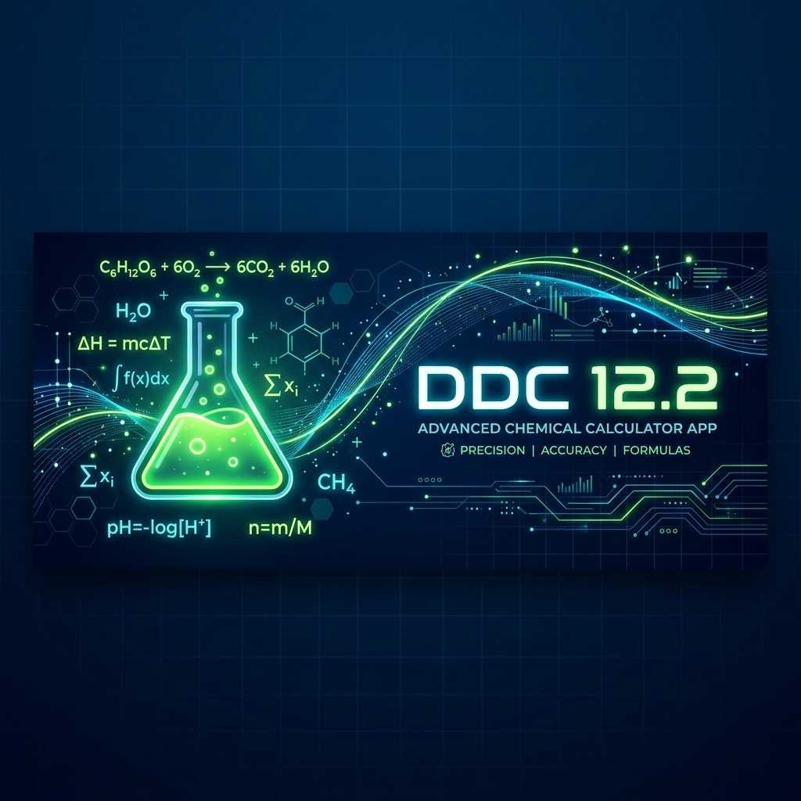
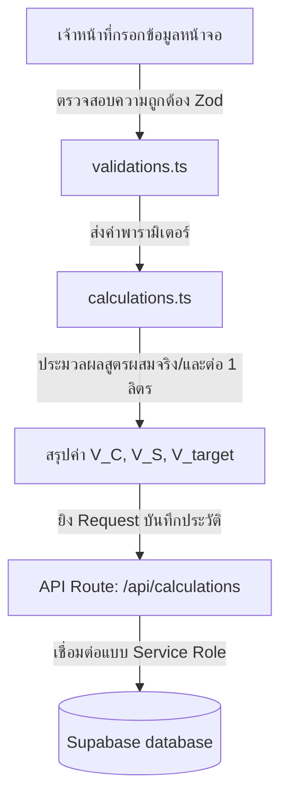

# ระบบคำนวณและประเมินสารเคมี DDC 12.2 (Chemical Calculator)

<div align="center">
  
</div>

<div align="center">


**เครื่องมือคำนวณและบริหารจัดการสัดส่วนสารเคมีควบคุมยุงลาย สำหรับศูนย์ควบคุมโรคติดต่อนำโดยแมลงที่ 12.2 สงขลา**

</div>

---

## 📖 สารบัญ (Table of Contents)
1. [ภาพรวมของโปรเจกต์ (Overview)](#1-ภาพรวมของโปรเจกต์-overview)
2. [คุณสมบัติหลักของระบบ (Features)](#2-คุณสมบัติหลักของระบบ-features)
3. [เทคโนโลยีที่เลือกใช้ (Tech Stack)](#3-เทคโนโลยีที่เลือกใช้-tech-stack)
4. [เริ่มต้นใช้งานสำหรับนักพัฒนา (Getting Started)](#4-เริ่มต้นใช้งานสำหรับนักพัฒนา-getting-started)
5. [ตัวอย่างการใช้งานจริง (Usage & Scenarios)](#5-ตัวอย่างการใช้งานจริง-usage--scenarios)
6. [การตั้งค่าสภาพแวดล้อม (Configuration)](#6-การตั้งค่าสภาพแวดล้อม-configuration)
7. [โครงสร้างและสถาปัตยกรรมระบบ (Architecture)](#7-โครงสร้างและสถาปัตยกรรมระบบ-architecture)
8. [แนวทางการพัฒนาและส่งมอบงาน (Contributing)](#8-แนวทางการพัฒนาและส่งมอบงาน-contributing)
9. [สัญญาอนุญาตการใช้งาน (License)](#9-สัญญาอนุญาตการใช้งาน-license)

---

## 1. ภาพรวมของโปรเจกต์ (Overview)

แอปพลิเคชันระบบคำนวณสารเคมี DDC 12.2 เป็นเครื่องมือสนับสนุนการปฏิบัติงานของเจ้าหน้าที่และอาสาสมัคร **ศูนย์ควบคุมโรคติดต่อนำโดยแมลงที่ 12.2 สงขลา** ในการคำนวณสัดส่วนของสารเคมีกำจัดยุงลาย (เช่น เดลตาไซด์ หรือ ซับมาริน) ร่วมกับตัวทำละลาย (น้ำมันดีเซล หรือ น้ำ) 

แต่เดิม เจ้าหน้าที่ต้องนำอัตราส่วนจากฉลากขวดมาคำนวณด้วยมือหรือเครื่องคิดเลขทั่วไป ซึ่งมีความล่าช้าและเสี่ยงต่อการตวงสารเคมีผิดพลาด ส่งผลต่อประสิทธิภาพในการควบคุมโรคไข้เลือดออก ระบบนี้จึงถูกออกแบบมาเพื่อแก้ปัญหาดังกล่าวแบบครบวงจร โดยการคำนวณผ่านระบบอัตโนมัติที่ถูกต้องแม่นยำ พร้อมทั้งบันทึกพิกัด GPS เพื่อรายงานคลังยาในแต่ละหมู่บ้านผ่านทางแดชบอร์ด

---

## 2. คุณสมบัติหลักของระบบ (Features)

*   **🧪 เครื่องคำนวณสัดส่วนอัจฉริยะ (Bento Calculator):** แสดงผลลัพธ์การคำนวณแยกตามสัดส่วนสารออกฤทธิ์และตัวทำละลายได้อย่างรวดเร็ว รองรับทั้งรูปแบบหมอกควัน (Fogging) และ ULV ตามสูตรมาตรฐาน
*   **🚀 คำนวณตวงสารรวม (Target Volume Mix):** ช่องกรอกแบบใหม่ที่ช่วยให้ผู้ใช้งานระบุขนาดถังผสมยารวม (ลิตร) แล้วระบบจะคำนวณหาปริมาณสารเคมี (มล.) และ น้ำ/น้ำมัน (ลิตร) ที่ต้องใช้ผสมจริงในถังให้ทันที
*   **📍 ปักหมุดแผนที่และ GPS:** รองรับการดึงค่าพิกัดปัจจุบันผ่าน GPS ของเบราว์เซอร์อัตโนมัติ หรือจิ้มปักหมุดบนแผนที่นำทาง Leaflet.js
*   **📊 แผงควบคุมแอดมินเชิงวิเคราะห์ (3-in-1 Dashboard):** หน้าแดชบอร์ดสำหรับแอดมินแยกตามระดับความสนใจ (ปฏิบัติการ, เชิงลึก, กลยุทธ์) พร้อมกราฟแสดงปริมาณการใช้สารเคมี (Volume Total)
*   **📂 ระบบจัดการข้อมูลโปรไฟล์ (Profiles CRUD):** แอดมินสามารถเพิ่มสูตรเคมี หรือแก้ไขฉลากยาแบรนด์ใหม่ ๆ ได้อย่างอิสระผ่านระบบจัดการหลังบ้าน
*   **📥 ส่งออกข้อมูลรายงาน Excel (5 รูปแบบ):** รองรับการดาวน์โหลดสรุปผลออกมาเป็นไฟล์ Excel `.xlsx` ตามวัตถุประสงค์การใช้งานของหน่วยงาน ได้แก่ รายงานประจำวัน, ใบสั่งงานตวงยา, ตารางแบ่งโควตาพื้นที่, รายงานวิเคราะห์ต้นทุน และแบบฟอร์มรายงานมาตรฐานของกรมควบคุมโรค
*   **⏰ ระบบปลุกการทำงานฐานข้อมูล (Vercel Cron Jobs):** ระบบส่ง Request ไปสะกิด Supabase (Free Tier) ทุกวันอังคารและวันศุกร์เวลา 07:00 น. เพื่อป้องกันไม่ให้ฐานข้อมูลหยุดทำงานชั่วคราว (Database Sleep)

---

## 3. เทคโนโลยีที่เลือกใช้ (Tech Stack)

*   **แกนหลักและโครงสร้าง:** Next.js 16 (App Router, รันบน Turbopack)
*   **สไตล์และการออกแบบ:** Tailwind CSS v4, shadcn/ui, Radix UI Primitives, Lucide React
*   **ระบบฐานข้อมูลและการล็อกอิน:** Supabase (PostgreSQL), Next-Auth v5 (Credentials Provider)
*   **แผนที่และกราฟสถิติ:** Leaflet.js (React Leaflet) และ Recharts
*   **ตัวจัดการไฟล์รายงาน:** SheetJS (`xlsx`)
*   **ระบบการทดสอบ:** Vitest (Unit Testing)

---

## 4. เริ่มต้นใช้งานสำหรับนักพัฒนา (Getting Started)

### ข้อกำหนดเบื้องต้น (Prerequisites)
*   **Node.js:** เวอร์ชัน 20.9.0 หรือสูงกว่า (แนะนำรุ่น LTS)
*   **npm:** เวอร์ชัน 10 ขึ้นไป

### ขั้นตอนการรันระบบบนเครื่องตัวเอง (Local Development)

1. **คัดลอกโปรเจกต์ลงเครื่อง:**
   ```bash
   git clone https://github.com/Han-tkp/ddc-12-2-calculator.git
   cd ddc-12-2-calculator
   ```

2. **ติดตั้งไลบรารีทั้งหมด:**
   ```bash
   npm install
   ```

3. **สร้างไฟล์สภาพแวดล้อม (.env):**
   คัดลอกไฟล์ตัวอย่างสภาพแวดล้อม:
   ```bash
   cp .env.example .env
   ```
   *เปิดไฟล์ `.env` บนโปรแกรมแก้ไขข้อความของคุณ แล้วระบุค่า API ของ Supabase และรหัสความปลอดภัยหลัก (ดูหัวข้อ [การตั้งค่าสภาพแวดล้อม](#6-การตั้งค่าสภาพแวดล้อม-configuration))*

4. **เริ่มรันเซิร์ฟเวอร์โหมดพัฒนา (Development Server):**
   ใช้คำสั่งนี้เพื่อรันโปรเจกต์ด้วย Node v20 ที่เตรียมไว้:
   ```bash
   PATH="./node-v20.12.2-linux-x64/bin:$PATH" npm run dev
   ```
   *เปิดดูผลลัพธ์ผ่านเว็บเบราว์เซอร์ที่: [http://localhost:3000](http://localhost:3000)*

5. **การ Build สำหรับใช้งานจริง (Production):**
   ทำการคอมไพล์โค้ด:
   ```bash
   npm run build
   ```
   รันเซิร์ฟเวอร์โปรดักชัน:
   ```bash
   npm run start
   ```

### การรันระบบด้วย Docker (Docker Deployment)

หากต้องการนำระบบไปรันบนเซิร์ฟเวอร์อื่นหรือเครื่องที่ไม่มี Node.js สามารถใช้ Docker และ Docker Compose ได้ (ระบบมีการตั้งค่า Multi-stage build ที่ปรับแต่งขนาด Image ให้เล็กกะทัดรัด):

1. **เตรียมไฟล์สภาพแวดล้อม:**
   ตั้งค่า `.env` ตามขั้นตอนที่ 3 ด้านบนให้เรียบร้อย (ระบบจะโหลดค่าจาก `.env` อัตโนมัติเมื่อรันด้วย Docker Compose)

2. **สั่ง Build และเริ่มระบบ:**
   รันคำสั่งต่อไปนี้ในโฟลเดอร์โปรเจกต์:
   ```bash
   docker compose up --build -d
   ```
   *ระบบจะเปิดใช้งานที่พอร์ต `3000` (http://localhost:3000)*

3. **คำสั่งจัดการที่ควรทราบ:**
   * ดู Logs การทำงาน: `docker compose logs -f`
   * หยุดการทำงาน: `docker compose down`

---

## 5. ตัวอย่างการใช้งานจริง (Usage & Scenarios)

### ขั้นตอนการคำนวณและตวงผสมจริง (ถังผสม 10 ลิตร)
1. ผู้ใช้งานเลือกฉลากยาจากแถบเลือกด้านบน (เช่น `Deltacide (หมอกควัน)`)
2. ใส่จำนวนหลังคาเรือนเป้าหมายที่ต้องการพ่นยา เช่น `40` หลังคาเรือน
3. กำหนดปริมาณน้ำยาพ่นที่ต้องการเตรียมรวมเท่ากับ `10` ลิตร (ตามความจุถังผสมของหน้างาน)
4. กดปุ่ม **"คำนวณ"** ระบบจะประมวลผลลัพธ์สองส่วนแบบเคียงข้างกัน:
   - บล็อกซ้าย: สัดส่วนมาตรฐานต่อ 1 ลิตร
   - **บล็อกขวา (ไฮไลท์สีเขียว):** ยอดผสมจริงในถัง 10 ลิตร ซึ่งระบบจะระบุให้ตวงสารเดลตาไซด์เข้มข้น `126.58` ซีซี และเติมน้ำมันดีเซลเพิ่มลงไปจนครบ `10` ลิตรทันทีโดยไม่ต้องคำนวณมือ

### การรันตรวจสอบการทดสอบโค้ด (Unit Testing)
นักพัฒนาสามารถทดสอบว่าสูตรคำนวณและระบบความปลอดภัยในโปรแกรมทำงานได้ถูกต้องหรือไม่ ผ่านคำสั่ง:
```bash
npx vitest run
```

---

## 6. การตั้งค่าสภาพแวดล้อม (Configuration)

ตารางแสดงตัวแปรหลักที่ต้องกำหนดในไฟล์ `.env` สำหรับเชื่อมต่อกับระบบ Supabase และหลังบ้าน:

| ตัวแปรหลัก | ค่าเริ่มต้น / คำอธิบาย | ตัวอย่างการใช้งาน |
| :--- | :--- | :--- |
| `AUTH_SECRET` | คีย์สำหรับเข้ารหัสความปลอดภัยของการล็อคอิน Next-Auth | `super-secret-auth-key-123` |
| `ENCRYPTION_KEY` | คีย์ขนาด 32 ตัวอักษรสำหรับใช้เข้ารหัสข้อมูลชื่อเจ้าหน้าที่ลงฐานข้อมูล | `12345678901234567890123456789012` |
| `NEXT_PUBLIC_SUPABASE_URL` | URL ของโปรเจกต์ฐานข้อมูลหลักบน Supabase | `https://your-project.supabase.co` |
| `NEXT_PUBLIC_SUPABASE_ANON_KEY` | คีย์สาธารณะสำหรับเชื่อมข้อมูลฝั่งหน้าบ้าน | `eyJhbGciOiJIUzI1NiIsInR5...` |
| `SUPABASE_SERVICE_ROLE_KEY` | คีย์สิทธิ์สูงสุดของระบบสำหรับอัปเดตข้อมูลบนหลังบ้าน | `eyJhbGciOiJIUzI1NiIsInR5...` |
| `API_SECRET_KEY` | รหัสผ่านสำหรับเชื่อมข้อมูลกับแอปพลิเคชันเวอร์ชัน Desktop | `desktop-api-secret-key` |

---

## 7. โครงสร้างและสถาปัตยกรรมระบบ (Architecture)

แผนผังการไหลของข้อมูลเมื่อมีการคำนวณและบันทึกประวัติ:



---

## 8. แนวทางการพัฒนาและส่งมอบงาน (Contributing)

หากต้องการร่วมพัฒนา ปรับปรุง UI หรือเพิ่มสูตรคำนวณฉลากยาใหม่ๆ:
1. เปิด **Issue** ก่อนเสมอ โดยใช้เทมเพลตที่จัดไว้:
   - `for-agent` — งาน Safe Fix/Refactor ที่ deterministic มีชุดทดสอบรองรับ มอบให้ AI Agent ทำงานอัตโนมัติ
   - `human-in-the-loop` — งานซับซ้อนที่ต้องออกแบบโครงสร้างก่อน (AI ยังไม่ควรจัดการเอง)
   - `spec-grooming` — งานที่สเปกยังไม่ชัด ต้องขุดรายละเอียดและ Test Scenarios ก่อน (เทคนิค Grill Me)
2. ทำการ **Fork** โปรเจกต์นี้ไปยัง Repository ส่วนตัวของคุณ
3. สร้าง Feature Branch: `git checkout -b feature/amazing-feature`
4. ก่อนส่งโค้ดเข้ามา โปรดรันคำสั่งเช็คความสะอาดและรัน Unit Test ทุกครั้ง:
   ```bash
   npm run lint
   npm run typecheck
   npm test
   ```
5. Commit การแก้ไขด้วยข้อความแบบมีระเบียบ (เช่น `feat: add new chemical formula profile`)
6. Push ขึ้น Branch: `git push origin feature/amazing-feature`
7. เปิด **Pull Request** เข้ามาที่สาขาหลัก (`main`) เพื่อรับการตรวจโค้ด — CI (lint, typecheck, test, build, security audit) จะรันอัตโนมัติทุก PR

---

## 9. ข้อควรทราบเกี่ยวกับสิทธิ์การรันสคริปต์ (GitHub Actions Permission)

ในการทดสอบรันระบบ Keep-Alive บนเซิร์ฟเวอร์จำลองของ GitHub Actions หากตรวจพบการแจ้งเตือนรอยแดงเตือนภัยเกี่ยวกับสิทธิ์การเข้าถึงไฟล์:

```text
fatal: detected dubious ownership in repository at '/home/runner/work/...
```

**สาเหตุ:** 
เกิดจากระบบรักษาความปลอดภัยของ Git บนเครื่องจำลองประมวลผล (Ubuntu) ตรวจพบว่าสิทธิ์ผู้ดูแลระบบ (Root) ขัดกับผู้สั่งรันชุดคำสั่ง ทำให้เกิดข้อความเตือนด้านความปลอดภัยขึ้น แม้จะไม่ได้บล็อกการทำงานจริงของคำสั่ง `curl` ปลายทางก็ตาม

**วิธีแก้ไขในโปรเจกต์นี้:**
เนื่องจากการสั่งปิง Supabase API ใช้เพียงคำสั่งยิง `curl` ผ่านเครือข่ายภายนอกเท่านั้น เราจึงตัดขั้นตอนการดึงไฟล์โค้ดทั้งโปรเจกต์มาเปิดอ่าน (`actions/checkout`) ออกไปจากไฟล์ [supabase-keep-alive.yml](file:///home/h4n/Desktop/ddc-12-2-calculator/.github/workflows/supabase-keep-alive.yml) วิธีนี้จะช่วยแก้ปัญหาเรื่องสิทธิ์ Git Dubious Ownership ได้ถาวร รันผ่านแบบสีเขียวสะอ้านไม่มีสีแดงเตือน และประหยัดเวลาการทำงานของเครื่องจำลองได้เร็วขึ้น

---

## 10. สัญญาอนุญาตการใช้งาน (License)

โปรเจกต์นี้เผยแพร่และควบคุมภายใต้สิทธิ์ **MIT License** อนุญาตให้ใช้งาน ปรับปรุง และเผยแพร่เพื่อการศึกษาและการปฏิบัติงานของศูนย์ควบคุมโรค 12.2 สงขลา

